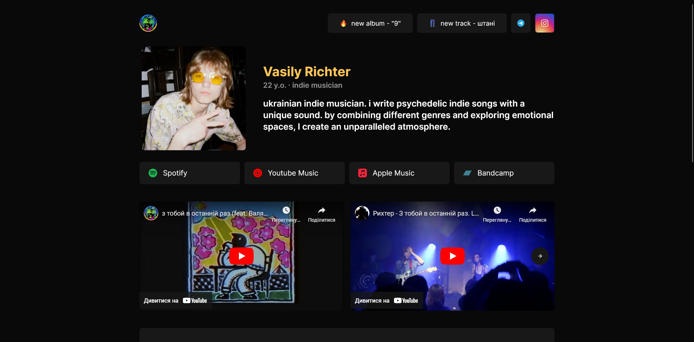
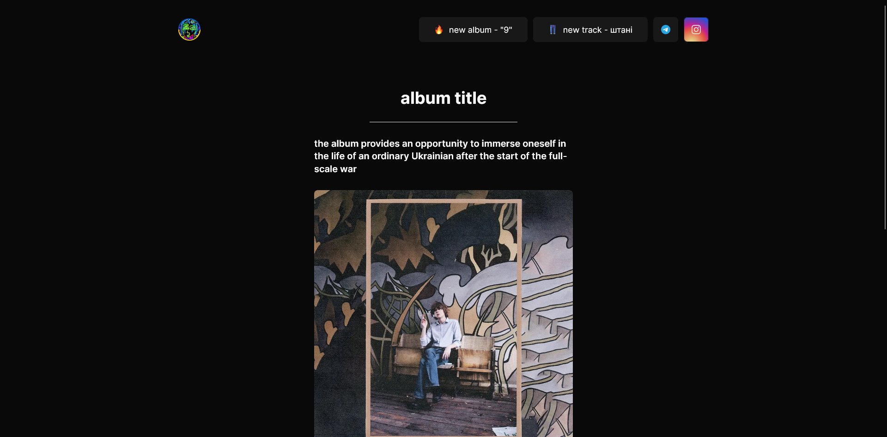

# Rihter Site

 

[Figma Prototype](https://www.figma.com/proto/eVEViQpveW5I6HL1AH74E8/rihter-site?page-id=0%3A1&node-id=1%3A2&viewport=282%2C250%2C0.68&scaling=contain)

## Tools used
- Nuxt 3
- [@vueuse/motion](https://motion.vueuse.org/)
- TailwindCSS
- Vercel
- Figma
- Sanity CMS

## Fetures
- i18n (Ukrainian, English)
- responsive design
- subtle animations
- cms to manage content

## Todo
- [ ] design light theme
- [ ] refactor data fetching
- [ ] use pinia to store fetched data
- [ ] make icon color dynamic in for listen button
- [ ] make general components & inherit new components from them (refactor)
- [ ] add stylelint
- [ ] write vue plugin for youtube iframe
- [ ] write vue plugin for bandcamp iframe
- [ ] think of alternative implementation of "news" bar
- [ ] update figma template
- [ ] refactor sanity schemas
- [ ] refactor youtube carousel
- [x] add animations everywhere
- [x] refactor index page
- [x] improve directory structure
- [x] fix hamburger menu position on mobile devices
- [x] add CMS to manage content
- [x] fill with content
- [x] add meta information & images for og and twitter
- [x] fix swiper carousel scrolling on mobile